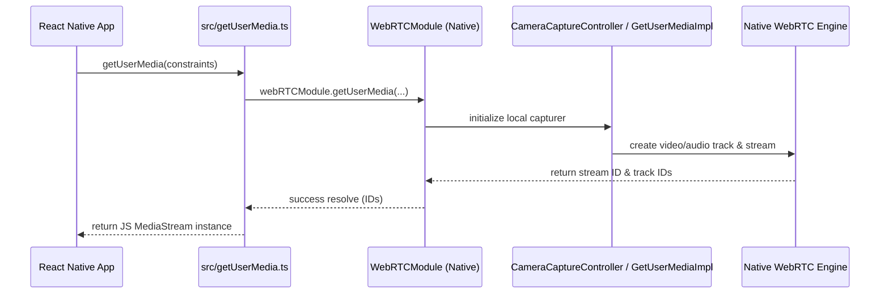

# Architecture Documentation: React Native WebRTC

This document outlines the architectural structure, component relationships, and data flows of the React Native WebRTC library codebase based on the dependency graph.

---

## 1. Executive Summary

This codebase provides WebRTC bindings for React Native, enabling real-time audio/video streaming, screen sharing, data channel communication, and media processing across Android, iOS, and macOS platforms. 

The architecture consists of three primary layers:
1. **JavaScript / TypeScript API Layer (`src/`)**: Implements W3C-compliant WebRTC interfaces (`RTCPeerConnection`, `MediaStream`, `MediaStreamTrack`, `RTCDataChannel`, etc.) and bridges user interactions to native code.
2. **Android Native Layer (`android/src/...`)**: Java-based implementation wrapping WebRTC native libraries (`org.webrtc`), managing Android media projection, camera capturers, rendering, and thread management.
3. **iOS Native Layer (`ios/RCTWebRTC/`)**: Objective-C implementation providing iOS/macOS WebRTC bindings, picture-in-picture (PiP) controllers, sample buffer rendering, and screen capture mechanisms.
4. **Examples & Test Applications (`examples/`)**: Demonstration projects (`GumTestApp`, `GumTestApp_macOS`) for testing mobile and desktop environments.

---

## 2. High-Level Architecture Diagram

```mermaid
graph TD
    subgraph JS_Layer ["JavaScript / TypeScript Layer (src/)"]
        Index["src/index.ts"]
        GUM["src/getUserMedia.ts"]
        GDM["src/getDisplayMedia.ts"]
        MediaDevices["src/MediaDevices.ts"]
        PeerConn["src/RTCPeerConnection.ts"]
        MediaStream["src/MediaStream.ts"]
        MediaTrack["src/MediaStreamTrack.ts"]
        DataChannel["src/RTCDataChannel.ts"]
        EE["src/EventEmitter.ts"]
        RTCUtil["src/RTCUtil.ts"]
        RTCPIP["src/RTCPIPView.tsx"]
        RTCViewJS["src/RTCView.ts"]
    end

    subgraph Android_Layer ["Android Native Layer"]
        WebRTCModulePy["WebRTCModulePackage.java"]
        WebRTCModuleJava["WebRTCModule.java"]
        GUMImpl["GetUserMediaImpl.java"]
        CamCap["CameraCaptureController.java"]
        ScrCap["ScreenCaptureController.java"]
        MediaProjServ["MediaProjectionService.java"]
        PeerObs["PeerConnectionObserver.java"]
        RTCVideoManager["RTCVideoViewManager.java"]
        WebRTCViewJava["WebRTCView.java"]
        AndroidEffects["videoEffects / ProcProvider"]
    end

    subgraph iOS_Layer ["iOS Native Layer (ios/RCTWebRTC/)"]
        WebRTCModuleH["WebRTCModule.h"]
        WebRTCMediaStream["WebRTCModule+RTCMediaStream.h"]
        WebRTCPeerConn["WebRTCModule+RTCPeerConnection.h"]
        WebRTCDataChan["WebRTCModule+RTCDataChannel.h"]
        IOSCapController["CaptureController.h"]
        IOSScrCap["ScreenCaptureController.h"]
        IOSVideoViewManager["RTCVideoViewManager.h"]
        IOSPIP["PIPController.h"]
        IOSEffects["videoEffects / VideoEffectProcessor.h"]
    end

    %% JS Internal Dependencies
    Index --> GUM
    Index --> GDM
    Index --> EE
    Index --> RTCPIP
    MediaDevices --> GUM
    MediaDevices --> GDM
    GUM --> RTCUtil
    MediaStream --> RTCUtil
    MediaTrack --> EE
    MediaTrack --> RTCUtil
    PeerConn --> EE
    PeerConn --> RTCUtil
    DataChannel --> EE

    %% JS to Native Bridge Dependencies
    Index --> WebRTCModuleJava
    GUM --> WebRTCModuleJava
    GDM --> WebRTCModuleJava
    EE --> WebRTCModuleJava
    MediaStream --> WebRTCModuleJava
    MediaTrack --> WebRTCModuleJava
    PeerConn --> WebRTCModuleJava
    DataChannel --> WebRTCModuleJava
    MediaDevices --> WebRTCModuleJava

    %% Android Internal Dependencies
    WebRTCModulePy --> WebRTCModuleJava
    WebRTCModulePy --> RTCVideoManager
    WebRTCModuleJava --> GUMImpl
    WebRTCModuleJava --> PeerObs
    GUMImpl --> CamCap
    GUMImpl --> ScrCap
    GUMImpl --> MediaProjServ
    GUMImpl --> AndroidEffects
    RTCVideoManager --> WebRTCViewJava

    %% iOS Categories & Bridge
    WebRTCModuleH --> WebRTCModuleJava
    WebRTCMediaStream --> WebRTCModuleH
    WebRTCMediaStream --> IOSCapController
    WebRTCMediaStream --> IOSEffects
    WebRTCPeerConn --> WebRTCModuleH
    WebRTCDataChan --> WebRTCModuleH
    IOSPIP --> IOSVideoViewManager
```

---

## 3. Subsystem Breakdown

### 3.1 JavaScript / TypeScript API Layer (`src/`)

This layer exposes W3C WebRTC-compatible APIs to React Native applications.

*   **Entry Point & Registration (`src/index.ts`)**: Registers global WebRTC primitives (`registerGlobals`) and connects the TS API with native platform events and controls.
*   **Media Acquisition (`src/getUserMedia.ts`, `src/getDisplayMedia.ts`, `src/MediaDevices.ts`)**:
    *   `getUserMedia`: Invokes camera/microphone stream acquisition via native modules using normalized constraints processed by `src/RTCUtil.ts`.
    *   `getDisplayMedia`: Handles screen/display capturing requests.
    *   `MediaDevices`: Implements the `navigator.mediaDevices` interface.
*   **Peer Connection & Transport (`src/RTCPeerConnection.ts`, `src/RTCDataChannel.ts`, `src/RTCRtpSender.ts`, `src/RTCRtpReceiver.ts`, `src/RTCRtpTransceiver.ts`)**:
    *   Manages connection state, SDP negotiation, ICE candidates, and data channel messaging.
*   **Streams & Tracks (`src/MediaStream.ts`, `src/MediaStreamTrack.ts`)**:
    *   Represents audio/video tracks and stream objects, binding native track IDs to JS objects.
*   **UI Views (`src/RTCView.ts`, `src/RTCPIPView.tsx`, `src/ScreenCapturePickerView.ts`)**:
    *   Provides React components for rendering WebRTC video tracks and iOS Picture-in-Picture (PiP) functionality (`startIOSPIP`, `stopIOSPIP`).
*   **Utilities & Events (`src/EventEmitter.ts`, `src/RTCUtil.ts`)**:
    *   `EventEmitter`: Native event hub for handling asynchronous events sent from native land (`setupNativeEvents`, `addListener`, `removeListener`).
    *   `RTCUtil`: Helper functions for media constraint normalization, SDP validation, and ID generation (`normalizeMediaConstraints`, `isSdpTypeValid`, `uniqueID`).

### 3.2 Android Native Module (`android/src/main/java/com/oney/WebRTCModule/`)

Provides native Android implementation using native WebRTC Java SDK (`org.webrtc`).

*   **Module Core & Packaging**:
    *   `WebRTCModulePackage.java`: Packages the module for React Native integration.
    *   `WebRTCModule.java`: Central React Context Native Module handling JS calls, initializing WebRTC peer factories, and managing threads.
*   **Media Capture & Projections**:
    *   `GetUserMediaImpl.java`: Core engine behind `getUserMedia` and `getDisplayMedia`.
    *   `CameraCaptureController.java` & `AbstractVideoCaptureController.java`: Wraps Camera1 and Camera2 helpers (`Camera1Helper.java`, `Camera2Helper.java`).
    *   `ScreenCaptureController.java` & `MediaProjectionService.java`: Controls Android display capture and foreground notifications (`MediaProjectionNotification.java`).
*   **PeerConnection & Observers**:
    *   `PeerConnectionObserver.java`: Handles WebRTC native peer connection events (ICE state, stream/track addition, data channels).
    *   `DataChannelWrapper.java`: Wraps native data channels.
    *   `VideoTrackAdapter.java`: Manages video track bindings.
*   **Video Effects & Codecs**:
    *   `videoEffects/`: Interfaces and providers (`ProcessorProvider`, `VideoEffectProcessor`, `VideoFrameProcessor`) for custom frame processing.
    *   `webrtcutils/`: Software and hardware codec factories (`H264AndSoftwareVideoDecoderFactory`, `H264AndSoftwareVideoEncoderFactory`, `SoftwareVideoDecoderFactoryProxy`, `SoftwareVideoEncoderFactoryProxy`).
*   **UI Rendering**:
    *   `RTCVideoViewManager.java` & `WebRTCView.java`: Renders native video streams inside React Native view hierarchies using EGL context (`EglUtils.java`).

### 3.3 iOS Native Module (`ios/RCTWebRTC/`)

Objective-C layer implementing native iOS/macOS web media capabilities.

*   **Module Categories**:
    *   `WebRTCModule.h`: Core bridge interface.
    *   `WebRTCModule+RTCMediaStream.h`: Media stream lifecycle and capture controller attachment.
    *   `WebRTCModule+RTCPeerConnection.h`: PeerConnection factory management and session negotiation.
    *   `WebRTCModule+RTCDataChannel.h`: Data channel routing.
    *   `WebRTCModule+VideoTrackAdapter.h`: Adapts iOS native video tracks for React Native.
*   **Capturers & Controllers**:
    *   `CaptureController.h` & `VideoCaptureController.h`: Video input capture management.
    *   `ScreenCaptureController.h` & `ScreenCapturer.h`: iOS screen sharing implementation.
    *   `CapturerEventsDelegate.h` & `TrackCapturerEventsEmitter.h`: Event dispatching for camera/screen capture events.
*   **Rendering & Picture-in-Picture**:
    *   `RTCVideoViewManager.h`: Native view manager for rendering remote/local tracks.
    *   `PIPController.h`: Manages iOS Picture-in-Picture mode.
    *   `SampleBufferVideoCallView.h`: Sample-buffer-based custom video renderer.
    *   `ScreenCapturePickerViewManager.h`: System screen capture picker view for iOS.
*   **Video Processing**:
    *   `videoEffects/`: `ProcessorProvider.h`, `VideoEffectProcessor.h`, and `VideoFrameProcessor.h` enable custom frame filtering.

### 3.4 Examples (`examples/`)

Contains two standard React Native test harness applications:
*   `examples/GumTestApp`: Mobile React Native example project testing `getUserMedia` and `RTCPIPView`.
*   `examples/GumTestApp_macOS`: macOS desktop port and testing harness for desktop React Native WebRTC execution.

---

## 4. Key Workflows & Data Flows

### 4.1 Media Capture (`getUserMedia` Flow)

1. **JS Call**: Application invokes `getUserMedia(constraints)` in `src/getUserMedia.ts`.
2. **Constraint Normalization**: Constraints are processed via `RTCUtil.normalizeConstraints()`.
3. **Native Invocation**: Call is dispatched over the bridge to `WebRTCModule.java` (Android) or `WebRTCModule+RTCMediaStream.h` (iOS).
4. **Capturer Initialization**: 
   * On Android, `GetUserMediaImpl.java` instantiates `CameraCaptureController` (using `Camera1Helper`/`Camera2Helper`) or `ScreenCaptureController`.
   * On iOS, `CaptureController` creates the camera capture pipeline.
5. **Stream Creation**: A native `MediaStream` and `MediaStreamTrack` are constructed and stored in memory.
6. **Bridge Response**: Native side returns track/stream IDs back to JS to construct JS `MediaStream` and `MediaStreamTrack` instances.

### 4.2 Peer Connection Setup & Data Channel Communication

1. **Instantiation**: App creates `new RTCPeerConnection(configuration)` in `src/RTCPeerConnection.ts`.
2. **Native Peer Creation**: `WebRTCModule` instantiates native `PeerConnection` with native observers (`PeerConnectionObserver.java`).
3. **Data Channel Creation**: Calling `createDataChannel` triggers native `DataChannelWrapper` creation.
4. **Event Dispatching**: Native events (e.g., ICE candidates, track additions, message events) pass from native observers through `EventEmitter.ts` (`setupNativeEvents`) to application listeners in JS.

---

## 5. Build & Configuration Files

*   `metro.config.js` & `metro.config.macos.js`: Metro bundler configurations for standard React Native and macOS builds.
*   `react-native.config.js`: Auto-linking configuration for React Native module discovery.